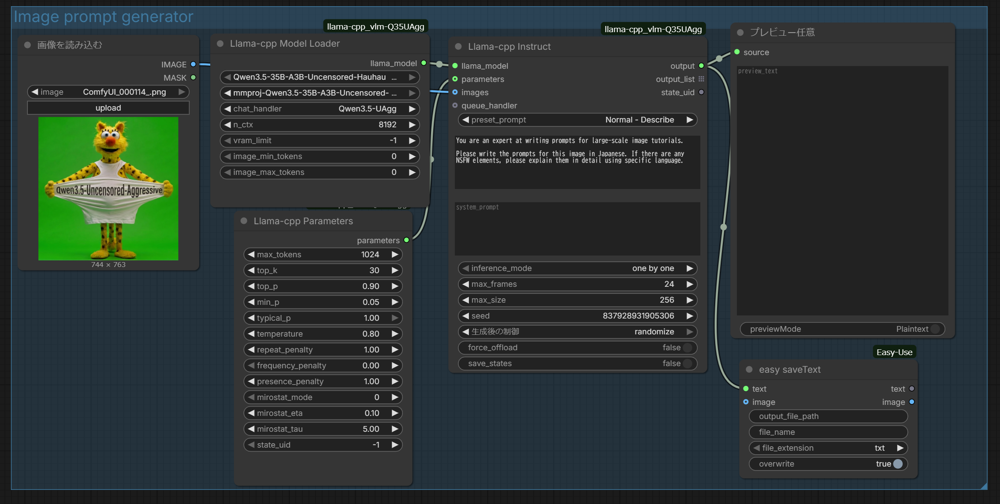

# ComfyUI-llama-cpp_vlm-Q3.5UAgg
## Summary (Requirements & Capabilities)

### 🚀 What This Fork Enables

- **Qwen3.5-35B-A3B-Uncensored-HauhauCS-Aggressive now supports image and video understanding**
- Fully integrated with **ComfyUI + llama.cpp (GGUF)** pipeline
- Enables **vision-based workflows inside ComfyUI**

---

### Requirements

#### 1. Model (GGUF)
Qwen3.5-35B-A3B-Uncensored-HauhauCS-Aggressive-Q8_0.gguf
#### 2. Matching mmproj (Required)
mmproj-Qwen3.5-35B-A3B-Uncensored-HauhauCS-Aggressive-f16.gguf


- Must match the model (e.g. 35B ↔ 35B)  
- Mixing (9B ↔ 35B) will break  

#### 3. llama-cpp-python (Working Build)

Must support:
- GGUF loading  
- Qwen3.5 handler  
- Vision (mmproj) support  

#### 4. Modified ComfyUI Custom Node

Added support for:
- Qwen3.5-UAgg  
- Vision (image / video) processing  

---

### Key Point

> This fork makes **Qwen3.5-UAgg usable as a vision model (image & video)** within the llama.cpp + ComfyUI ecosystem.


## Preview  


## Installation  

#### Install the node:  
```bash
cd ComfyUI/custom_nodes

# Clone this fork (Qwen3.5-UAgg supported version)
git clone https://github.com/yumi-ai-lab/ComfyUI-llama-cpp_vlm-Q3.5UAgg.git

# Install dependencies
python -m pip install -r ComfyUI-llama-cpp_vlm-Q3.5UAgg/requirements.txt
```

#### Download models:  
- Place your model files in the `ComfyUI/models/LLM` folder.  

	> If you need a VLM model to process image input, don't forget to download the `mmproj` weights.

## Credits  
- [llama-cpp-python](https://github.com/JamePeng/llama-cpp-python) @JamePeng  
- [ComfyUI-llama-cpp](https://github.com/kijai/ComfyUI-llama-cpp) @kijai  
- [ComfyUI](https://github.com/comfyanonymous/ComfyUI) @comfyanonymous
- [ComfyUI-llama-cpp_vlm](https://github.com/lihaoyun6/ComfyUI-llama-cpp_vlm)@lihaoyun6
